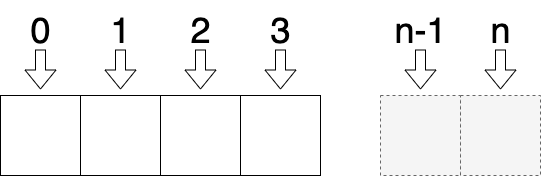

### Difference Between Vectors and Lists

If you had seen past few sections, you would have noticed vector is created by putting things between square brackets, and we can create a list by putting things between `'(` and `)`. Apart from that all operations are the same. So what's the real difference?

Imagine vector is a rack. Each compartment of the rack is named 0, 1, 2 and so on till n. 

You can put any thing in the compartment that's after the last filled one. See the example below:

[source, clojure]
----
(def numbers ["zero" "one" "two" "three" "four"])
(conj numbers "five")
----

Output

[source, clojure]
----
["zero" "one" "two" "three" "four" "five"]
----

In the above code, we add `"five"` to `numbers` and Clojure adds it to the last. A vector is a huge rack of contiguous spaces. Clojure can easily access any of the rack very easily because it's stored in a compact form in the memory. So even if you have a million element vector accessing the 7,546^>th^ is fast in Clojure. Like every thing this comes with a catch. Say you have a million element vector, and you want to add another element, if the adjacent space in memory is not available and is occupied by some other thing, Clojure should do the huge work finding continuous free space, then it must move all elements to it and add the new value at the end. This process of moving around data is very costly.

So if speed of random access with index is not important, and you need only sequential access, and if you want to add a lot of values to your collection, and you have large list to be stored, consider list.

image::images/list_element.png[]

A element in a list has two parts. One is the value, and another one is a pointer to the next element. So elements of a list can be anywhere in your computer memory as shown below.

image::images/list.png[]

Adding a new element means it will have the value you push to it, and its pointer will point to current first element. So now the new value is the first element of the list. The drawback is, if you want to access the n^th^ element of a list, then Clojure needs to traverse through n - 1 elements to get to it. The positive is adding element is very easy.
