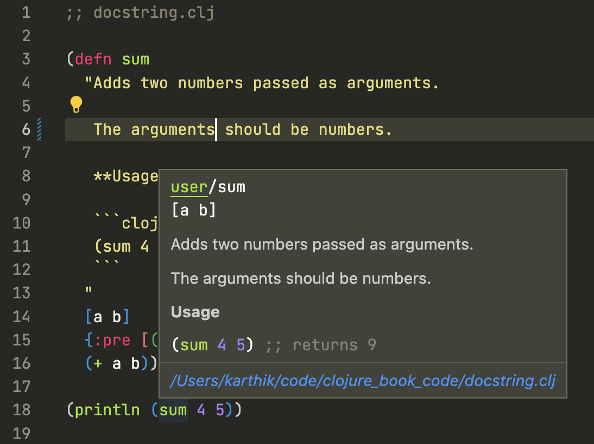

== Functions

Abstraction is the key to greatness and progress. Michael Faraday discovered electricity and magnetism have a link, but I don't think about it when I drive my car. Everything is abstracted away behind the steering wheel and pedals. Abstraction is so important, that almost every programming language provides a way to abstract away complexity.

Functions are the way you can abstract away things in Clojure. Whenever a code gets complex, you can refactor it out as functions, and use those functions as building blocks. In fact, you have been using functions all along, say when you call `(+ 1 2)` in Clojure, the `+` is a function, and `1` and `2` are the value it receives. Technically we call the values received by the function as arguments. You really not worried or don't know what happens in computer when you execute `(+ 1 2)`, it's been neatly abstracted away behind the function `+`.

So let's see how to build our own functions in this chapter.

=== Saying Hello With Functions

So this is the code in Clojure to print Hello World:

[source, clojure]
----
(println "Hello world!")
----

Now, I want to short it, I want to make this same functionality available by calling just `(say-hello)`. To do that I first call a function called `defn` or define function

[source, clojure]
----
(defn )
----

To it, as a first argument I pass the function name `say-hello`:

[source, clojure]
----
(defn say-hello)
----

Now `say-hello`` is passed to `defn`, but since `say-hello` is defined as a function, we can accept arguments for it, but here we need no arguments as we are going to print Hello World!, so lets put empty square braces as no arguments will be accepted by `say-hello`

[source, clojure]
----
(defn say-hello [])
----

Now all we need to do is to write the function body, in the body we print hello world as shown below:

[source, clojure]
----
(defn say-hello []
  (println "Hello world!"))
----

So when ever we call `(say-hello)`, Hello World! gets printed. Below code shows the final version of say hello:

[source, clojure]
----
;; function_say_hello.clj

(defn say-hello []
  (println "Hello world!"))

(say-hello)
----

Output

----
Hello world!
nil
----

=== Passing Argument

We can pass arguments to functions, say we have a function stem:[f(x) = x^2 + 2], this function accepts an argument stem:[x], now we plug in 7 to x, then stem:[f(7) = 51]. In the same way, a programming function can take in argument and do something with it.

Look at the say hello example below, type iit and execute it:

[source, clojure]
----
;; function_with_arguments.clj

(defn say-hello [name]
  (println "Hello" name "!"))

(say-hello "Karthik")
----

Output

----
Hello Karthik !
nil
----

It prints `Hello Karthik !`, so how it works? We `(defn say-hello ...)`, where we define a function named `say-hello`, bu then after that notice the `[name]` as shown below:

[source, clojure]
----
(defn say-hello [name]
  ;; function body goes here
  )
----

The `name` is an argument you need to pass for the function to run. It an be used as variable in the function. Notice how the function is structured, you have the `defn`, followed by the function name then there the square bracket containing the sigle argument name `[name]`. Now let's finish off the function by writing its body as shown:

[source, clojure]
----
(defn say-hello [name]
  (println "Hello" name "!"))
----

As function body, we are just printing saying hello to the `name` passed using `println` like this: `(println "Hello" name "!")`.

Now calling `say-hello` with argument `Karthik` `(say-hello "Karthik")` prints out `Hello Karthik !`. Modify the program to say hello to you.

=== Finding Area Of Circle

We know that area of circle is stem:[pi r^2], given radius of a circle is stored in a variable `radius`, we can write a Clojure code to find area as shown:

[source, clojure]
----
(* Math/PI (Math/pow radius 2))
----

Now, rather than writing as above, won't it be good if we can find area of circle by calling a function `circle-area`? That's what we do in code below: 


[source, clojure]
----
;; function_circle_area.clj

(defn circle-area [radius]
  (* Math/PI (Math/pow radius 2)))

(circle-area 7)
----

Output

----
153.93804002589985
----

In the above code, rather than dealing with `Math/PI` and finding power, all we need to do is to call `(circle-area 7)`, and we get the area of circle whose radius is 7 units. A good function abstracts complexity away and makes us write programs better and better.

=== Refactoring

Say your friend is coding a billion dollar startup that let's its customers find circle area using an app. Your friend had a successful pitch and investment round where he claimed that 1000s of people wanted to find circle area every day and his app will be useful for it. He knows you area great programmer and you coded the `circle-area` function for him. The app releases and humanity is saved.

You find that rather than finding circle area using  `(* Math/PI (Math/pow radius 2))`, you can find it by `(* Math/PI radius radius)`. The later is much simpler and easier to maintain. So all you need to do is to change the code in one place as shown:

[source, clojure]
----
;; function_circle_area_refactored.clj

(defn circle-area [radius]
  (* Math/PI radius radius))

(circle-area 7)
----

The rest of the code in the app is totally unaware of this change, and works just fine. Instead of abstracting things away as a function, if you put  `(* Math/PI (Math/pow radius 2))` everywhere, say in 50 places in app, it would be really difficult to change and test.

So functions help in better coding, and even reduces the possibility of bugs.

=== Function with multiple arguments

It's not that functions should have only one argument, say you want to find the hypotenuse of a  right angle triable of side lengths stem:[a] and stem:[b], then it can be written as a function stem:[f(a, b) = sqrt { a^2 + b^2 }]. So let's code this one in Clojure:

[source, clojure]
----
;; hypotenuse.clj

(defn hypotenuse [a b]
  (Math/sqrt (+ (* a a) (* b b))))

(hypotenuse 3 4)
----

Output

----
5.0
----

In the code above, we define a function `hypotenuse`, and it takes in two arguments `a` and `b`, so I think it should be clear to reader now, if a function take no arguments, the function name should be followed by empty square brackets `[]`, or if it does then the argument names should be included in those square brackets like `[a, b]` in this case. In the function body we just add the statement `(Math/sqrt (+ (* a a) (* b b)))`, which computes the hypotenuse and returns the number.

When we call `(hypotenuse 3 4)`, `5.0` get's returned.


Let's say for some reason we need a function where it can accept one argument, and the same function can also accept two arguments. We can do that too Clojure. Look at the code below:

[source, clojure]
----
;; function_multiple_arguments.clj

(defn multiple-args
  ([arg-1] (println "One argument passed:" arg-1))
  ([arg-1 arg-2] (println "Two argument passed:" arg-1 arg-2)))

(multiple-args 1)
(multiple-args 1 2)
----


Output

----
One argument passed: 1
Two argument passed: 1 2
----

So we have a function called `multiple-args`, that's defined like this

[source, clojure]
----
(defn multiple-args
  ;; function body goes here
  )
----

So in order to accept one argument, we add a form as shown below:

[source, clojure]
----
(defn multiple-args
  ([arg-1] (println "One argument passed:" arg-1)))
----

This form: 

[source, clojure]
----
([arg-1] (println "One argument passed:" arg-1))
----

Receives one argument `arg-1`: 

[source, clojure]
----
([arg-1] ...)
----

And in the body of the function we print it using `(println "One argument passed:" arg-1)` as shown:

[source, clojure]
----
([arg-1] (println "One argument passed:" arg-1))
----

So this will respond to a function call like `(multiple-args 1)`.

Now in order to have two or more arguments, we add this another form that has two arguments in it:

[source, clojure]
----
([arg-1 arg-2] (println "Two argument passed:" arg-1 arg-2))
----

So now this is our function definition which can accept one argument or two arguments:

[source, clojure]
----
(defn multiple-args
  ([arg-1] (println "One argument passed:" arg-1))
  ([arg-1 arg-2] (println "Two argument passed:" arg-1 arg-2)))
----

`([arg-1 arg-2] (println "Two argument passed:" arg-1 arg-2))` will be called when we call `(multiple-args 1 2)`.

As an exercise try writing code that will let you call `(multiple-args)`, which will print out `No argument passed`. If you are finding it difficult refer `function_multiple_arguments_exercise.clj` in the code examples.

=== Accepting unlimited arguments

It is possible to accept unlimited number of arguments in a Clojure function. For example `+` function can accept unlimited amount and can give us the sum:

[source, clojure]
----
(+ 1 2 3 5 7 -1)
----

Output

----
17
----

For our functions to accept unlimitted number of argument, but prefix argument with a `& ` (and and space), take a look at the code below:

[source, clojure]
----
;; function_unlimited_arguments.clj

(defn unlimited-arguments [& args]
  (println "Arguments:" args)
  (println "Type of args:" (type args)))

(unlimited-arguments 1)
(println)
(unlimited-arguments 1 17 true "Karthik" :coder)
----

Output

----
Arguments: (1)
Type of args: clojure.lang.ArraySeq

Arguments: (1 17 true Karthik :coder)
Type of args: clojure.lang.ArraySeq
----

In the above example we have `& args`, between square brackets, so  the function `unlimited-arguments` can accept any number of arguments.

Say if we call the function like this:

[source, clojure]
----
(unlimited-arguments 1)
----

Then we get the out put as `Arguments: (1)` which is generated by this statement:

[source, clojure]
----
(println "Arguments:" args)
----

In the above code snippet we are just printing the arguments. No in the below code snippet:

[source, clojure]
----
(println "Type of args:" (type args)
----

We are printing the type of `args` which seems to be `clojure.lang.ArraySeq`, which I think is some list. In similar fashion when we call:

[source, clojure]
----
(unlimited-arguments 1 17 true "Karthik" :coder)
----

All `1 17 true "Karthik" :coder`, seems to be bundled in `args` as a list, as you can see from the output its printed as `Arguments: (1 17 true Karthik :coder)`.

Let's say that we want a function where it accepts one or more arguments, we can code it like this:

[source, clojure]
----
;; function_unlimited_arguments_2.clj

(defn unlimited-arguments [first-arg & args]
  (println "First argument:" first-arg)
  (println "Other arguments:" args))

(unlimited-arguments 1)
(println)
(unlimited-arguments 1 17 true "Karthik" :coder)
----

Output

----
First argument: 1
Other arguments: nil

First argument: 1
Other arguments: (17 true Karthik :coder)
----

Look at `[first-arg & args]`, so the first argument get's captured in `first-arg`, the rest if they are there get's bundled up in `args` which is present after `&` inside the square braces.

In the example below, the function `unlimited-arguments`, has to have minimum of two arguments:

[source, clojure]
----
;; function_unlimited_arguments_3.clj

(defn unlimited-arguments [first-arg second-arg & args]
  (println "First argument:" first-arg)
  (println "Second argument:" second-arg)
  (println "Other arguments:" args))

(unlimited-arguments 1 2)
(println)
(unlimited-arguments 1 17 true "Karthik" :coder)
----

Output

----
First argument: 1
Second argument: 2
Other arguments: nil

First argument: 1
Second argument: 17
Other arguments: (true Karthik :coder)
----

The first argument is caught by `first-arg` and the second by `second-arg`, the rest is bundled up as list in `args`.

=== Returning stuff

If you think about a mathematical function, say stem:[f(x) = x^ + 2], if you plug in a value say stem:[x = 7], it returns 51. So you expect  a function to return something.

In clojure, the last statement executed by a function returns. Take for example the code below:

[source, clojure]
----
;; function_returning_something.clj

(defn add [a b]
  (+ a b))

(println (add 2  3))
----

Output

----
5
nil
----

In the code above, the result of `(+ a b)` is returned out of the function add. If you see `(+ a b)` is the last statement of the function `add`. This is been captured by `println` and is printed out. You might have noticed a nil in output, thats because `println` after printing `5` returns nothing or `nil` and hence `nil` gets printed in the REPL.

Another good example will be any math function in Clojure. kae for instance `+`

[source, clojure]
----
(+ 1 2 3 4 5)
----

Returns `15`, and hence if you try it out on the repl, you will get 15.

Now let's code something and see what it returns. Code the example below and execute it

[source, clojure]
----
;; what_it_returns.clj

(defn do-math [a b]
  (+ a b)
  (* a b))

(do-math 5 3)
----

Output

----
15
----


In function `do-math`, you see the first form is `(+ a b)`, when `(do-math 5 3)` is called, `(+ a b)` returns `8`, but it gets thrown away and lost, the last statement is `(* a b)`, and it returns 15, this is what gets returned from `do-math` and that's what appears as output.

Now lets code another function swapping the `*` and `+` as shown:

[source, clojure]
----
;; what_it_returns_2.clj

(defn do-math [a b]
  (* a b)
  (+ a b))

(do-math 5 3)
----

Output

----
8
----

In the above code, since `(+ a b)` ais at the last of the function, it get's returned. What's computed by `(* a b)` is lost.

The moral of the story is the last statement or forms output get's returned from a function.

=== Recursion

A function calling itself is known as recursion. For example look at the code below:

[source, clojure]
----
;; function_recursion.clj

(defn count-down [number]
  (println number)
  (if (pos? (dec number))
    (count-down (dec number))))

(count-down 5)
----

Output

----
5
4
3
2
1
nil
----

When executing the function, it prints from 5 to 1 and stops. We called the function like this: `(count-down 5)`. Let's analyze the function body:

[source, clojure]
----
(println number)
(if (pos? (dec number))
  (count-down (dec number)))
----

First we have the form / statement `(println number)` which prints out `5`, then it comes to this form:

[source, clojure]
----
(if (pos? (dec number))
  (count-down (dec number)))
----

So in the above code `(dec number)` is `4` and is positive, and hence `(pos? 4)` is `true`, hence the statement `(count-down (dec number))` gets executed, and so `(count-down 4)` is called. That is the function `count-down`` calls itself again.

This goes on till `number` becomes `0` and `(dec number)` is `-1` and hence `(pos? -1)` is `false` thus `(count-down (dec number))` is never reached and the program exits.

You can call a function from itself using the function name as in the example above, or you can use `recur` as shown below:

[source, clojure]
----
;; function_recur.clj

(defn count-down [number]
  (println number)
  (if (pos?  (dec number))
    (recur (dec number))))

(count-down 5)
----

Output

----
5
4
3
2
1
nil
----

In th example above, we have replace the function name `count-down` with `recur` when the function needs to call itself. It said that when we use `recur` it more memory efficient and the condition it must satisfy is hat `recur`` should be the last statement executed in the function.


In the example below, we use recursion to compute the total of sequence of numbers passed to a function. Type the code below and execute it, we will see how it works soon.

[source, clojure]
----
;; function_sum_using_recursion.clj

(defn sum [numbers total]
  (if (empty? numbers)
    total
    (recur (rest numbers) (+ total (first numbers)))))

(println (sum [1 2 3 4 5], 0))
----

Output

----
15
nil
----

In the above example we have tried out `sum` like this `(sum [1 2 3 4 5], 0)`, which returns `15`. to simplyfy it let's try out something as shown:

[source, clojure]
----
(sum [1 2] 0)
----

So when the above form is executed, let's look at the body of `sum`:

[source, clojure]
----
 (if (empty? numbers)
    total
    (recur (rest numbers) (+ total (first numbers))))
----

`(empty? [1 2])` become `false`, and  hance this get's executed:

[source, clojure]
----
(recur (rest numbers) (+ total (first numbers)))
----

When substituting values, we get the following:

[source, clojure]
----
(recur (rest [1 2]) (+ 0 (first [1 2])))
----

Which can be reduced to this:

[source, clojure]
----
(recur [2] (+ 0 1))
----

and so we get:

[source, clojure]
----
(recur [2] 1)
----

Since `recur` calls the same function it's in, we can write it as:

[source, clojure]
----
(sum [2] 1)
----

So now a `sum` is called with `numbers` taking tha value `[2]` and `total` taking he value `1`. Once again `(empty [2])` is `false` and we end up with

[source, clojure]
----
(recur (rest numbers) (+ total (first numbers)))
----

Which on substitution we get


[source, clojure]
----
(recur (rest [2]) (+ 1 (first [2])))
----

Now reducing it we get:

[source, clojure]
----
(recur [] (+ 1 2))
----

Substituting `recur` with `sum` and reducing `(+ 1 2 )` to `3` we get:

[source, clojure]
----
(sum [] 3)
----

So now `numbers` takes the value `[]` and `total` take the value `3`, now let's plug it into:

[source, clojure]
----
 (if (empty? numbers)
    total
    (recur (rest numbers) (+ total (first numbers))))
----

Here `(empty? numbers)` is `true` and hence `total` must be returned, hence `3` gets returned which is the sum of the vector `[1 2]`.

What if you don't want to pass the `total` and want a function that take a sequence and computes its sum. Take a look at the example below:


[source, clojure]
----
;; function_collection_sum.clj

(defn sum [numbers total]
  (if (empty? numbers)
    total
    (recur (rest numbers) (+ total (first numbers)))))

(defn collection-sum [collection]
  (sum collection 0))

(println (collection-sum [1 2 3 4 5]))
----

Output

----
15
nil
----

In the above example we have function `collection-sum` that takes a collection, it abstracts away by passing the collection and initial `total` as `0` to the `sum` function which we coded before. `sum` uses recursion to calculate the sum.


=== Multimethods


[source, clojure]
----
;; without_multimethods.clj

(defn print-welcome-message [person]
  (cond
    (string? person) (println "Welcome" person)
    (vector? person) (println  "Welcome" (first person) "from" (last person))
    (map? person)    (println "Welcome" (person "name") "from" (person "from"))))

(print-welcome-message "Karthik from Chennai")
(print-welcome-message ["Kalam" "Ramanthapuram"])
(print-welcome-message {"name" "Bharathiyaar" "from" "Yettaiyapuram"})
----

Output

----
Welcome Karthik from Chennai
Welcome Kalam from Ramanthapuram
Welcome Bharathiyaar from Yettaiyapuram
----

[source, clojure]
----
;; with_multimethods.clj

(defn welcome-person [person]
  (cond
    (string? person) :welcome-person-string
    (vector? person) :welcome-person-vector
    (map? person)    :welcome-person-map))

(defmulti print-welcome-message welcome-person)

(defmethod print-welcome-message :welcome-person-string [person]
  (println "Welcome" person))

(defmethod print-welcome-message :welcome-person-vector [person]
  (println  "Welcome" (first person) "from" (last person)))

(defmethod print-welcome-message :welcome-person-map [person]
  (println "Welcome" (person "name") "from" (person "from")))

(print-welcome-message "Karthik from Chennai")
(print-welcome-message ["Kalam" "Ramanthapuram"])
(print-welcome-message {"name" "Bharathiyaar" "from" "Yettaiyapuram"})
----

Output

----
Welcome Karthik from Chennai
Welcome Kalam from Ramanthapuram
Welcome Bharathiyaar from Yettaiyapuram
----

=== Pre and Post Condition Checking

Functions need data to operate on (well almost all of them). If the data is not passed in right format, then the function might cease to work. It's a good idea to check the data passed to a function. For that Clojure provides a `pre` hook. Let's learn how it works using an example. Type the code below.

[source, clojure]
----
;; function_pre.clj

(defn sum [a b]
  {:pre [(number? a) (number? b)]}
  (+ a b))

(println (sum 4 5))
;; (println (sum "4" 5)) ;; Thows an error
----

When you execute `(println (sum 4 5))`, it works, whereas `(println (sum "4" 5))`  throws an error. This is because of the following code snippet in `sum`:

[source, clojure]
----
{:pre [(number? a) (number? b)]}
----

So this is just a map with a key named `:pre`. This pre can check many things, so we pass many things as an vector to it. The first one being, we check if the first argument `a` is a number using thr condition `(number? a)`, the second one being we check if the second argument `b` is a number using `(number? b)`. The function body is executed ony all both the conditions passed inside the vector are true.

For `(sum 4 5)`, `a` is `4` and `b` is `5`, so the function `sum` executes. For `(sum "4" 5)`, "4" is a string hence `(number? a)` becomes false nd it throws an error.

When it's needed for one to check if returned value has some particular data format / structure, then we could use a post hook as shown below: 

[source, clojure]
----
;; function_post.clj

(defn sum [a b]
  {:post [(number? %)]}
  "45")

(defn sum-without-post [a b]
  "45")

(println (sum-without-post 4 5))
(println (sum 4 5)) ;; ; Assert failed: (number? %)
----

Type the code above and execute. In the above example, both `sum` and `sum-without-post` returns a string `"45"`. If you execute `(sum-without-post 4 5)`, it just runs, but as a human one would expect sum of two numbers to be a number, whereas `(sum 4 5)` throws an error because it returns a string and the post hook:

[source, clojure]
----
{:post [(number? %)]}
----

expects the returned output represented by percent `%` sign to be a number.

Now let's see `pre` and `post` hooks in action:

[source, clojure]
----
;; function_pre_post.clj

(defn sum [a b]
  {:pre [(number? a) (number? b)]
   :post [(number? %)]}
  (+ a b))

(println (sum 4 5))
----

What do you think will happen if we call `(sum 4 "5")` in above code?

=== Docstring

Documenting stuff is very important in programming. Clojure provides a way to document functions (which are first class citizens in this language). So look at the code below:

[source, clojure]
----
;; docstring.clj

(defn sum 
  "Adds two numbers passed as arguments.
   
   The arguments should be numbers.

   **Usage**

   ```clojure
   (sum 4 5) ;; returns 9
   ```
  " 
  [a b]
  {:pre [(number? a) (number? b)]}
  (+ a b))

(println (sum 4 5))
----

Right after `(def sum` we have this string:

[source, clojure]
----
  "Adds two numbers passed as arguments.
   
   The arguments should be numbers.

   **Usage**

   ```clojure
   (sum 4 5) ;; returns 9
   ```
  "
----

This string is nothing but documentation for the function. Note how I have used `**Usage**`, I have used mark down format. I have also used something like this in the doc string:

[source, markdown]
----
```clojure
   (sum 4 5) ;; returns 9
```
----

This tells to highlight `(sum 4 5) ;; returns 9` as Clojure code.

One can access documentation for `sum` using the `doc` function as shown:

----
clj꞉user꞉> (doc sum)
-------------------------
user/sum
([a b])
  Adds two numbers passed as arguments.
   
   The argumets should be numbers.

   **Usage**

   ```clojure
   (sum 4 5) ;; returns 9
   ```
  
nil
----

Or better in my VSCodium, all I just need to do is to hover over the function and I get a really neat looking documentation as a popup as shown:



=== Anonymous Functions

It is possible to define a function without a name, try out the code below:

[source, clojure]
----
;; anonymous_function.clj

(def print-something
  (fn [something]
    (println something)))

(print-something "something is better than nothing")
----

Output

----
something is better than nothing
----

Look at this snippet:

[source, clojure]
----
(fn [something]
  (println something))
----

This actually returns a function that accepts a single argument called `something`, and when `something` is passwd it prints it. Note that the function returned in the above snippet of code has no name. It's like a newly born baby. It functions but we have no way to identify it.

Now this anonymous function can be given a name by attaching it to a variable like this:

[source, clojure]
----
(def print-something
  (fn [something]
    (println something)))
----

In the above snippet of code, the anonymous function that prints `something` is defined to a name `print-something`, so from now on we can use it like `print-something "something is better than nothing")`.

In fact, the `defn` in clojure means `fn` function, that's been `def` defined or attached to a variable.

In short we can write this:

[source, clojure]
----
(def print-something
  (fn [something]
    (println something)))
----

as this:

[source, clojure]
----
(defn print-something [something]
    (println something))
----

and it would work fine.

=== Functions returning functions

One may be wondering what's the use of anonymous functions, well take a look at the example below and and execute it:

[source, clojure]
----
;; function_returning_function.clj

(defn multiplier [multiply-with]
  (fn [number]
    (* number multiply-with)))

(def double-it
  (multiplier 2))

(def triple-it
  (multiplier 3))

(double-it 21)

(triple-it 14)
----

When `(double-it 21)` is run, it returns `42`, now let's look at the definition of double it:

[source, clojure]
----
(def double-it
  (multiplier 2))
----

Well, in the above code, `double-it` is assigned to the output of `(multiplier 2)`, since `double-it` acts like a function, then `(multiplier 2)` should return a function, so let's look at the source of `multiplier`:

[source, clojure]
----
(defn multiplier [multiply-with]
  (fn [number]
    (* number multiply-with)))
----

Now take a look at what `multiplier` returns:

[source, clojure]
----
(fn [number]
  (* number multiply-with))
----

It returns a function as shown above, now if we replace `multiply-with` with `2`, we get as shown:


[source, clojure]
----
(fn [number]
  (* number 2))
----

So in the above code, we have a function that takes a `number` and returns its product with `2`. Now plug it in:

[source, clojure]
----
(def double-it
  (multiplier 2))
----

we get:

[source, clojure]
----
(def double-it
  (fn [number]
    (* number 2)))
----

In short we can write it as:

[source, clojure]
----
(defn double-it [number]
    (* number 2))
----

So what we have done is, in `multiplier`, we are building functions and returning it, and we are giving a name to it. Don't you think its a powerful concept?
