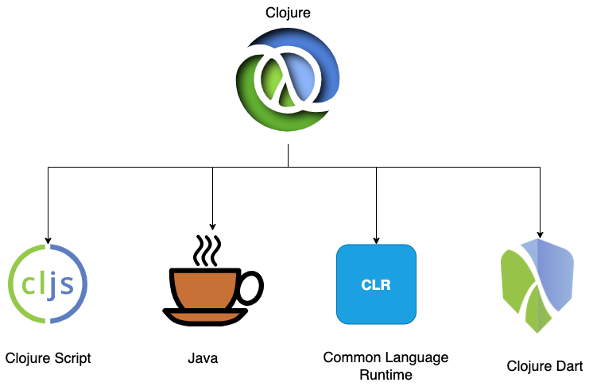

== Hosted Language

Clojure is a hosted language, which means its author does not intend it to be compiled to machine code that directly runs on a processor or an operating system. Clojure was initially intended to run on JRE (Java Runtime Environment), and so it gets converted to byte code. Since Clojure is hosted, people found ways to get Clojure to get compiled to JavaScript, hence was born Clojure Script https://clojurescript.org/. Clojure can be compiled to Common Language Runtime https://clojure.org/about/clojureclr, the same thing what Dot Net family of languages gets compiled to. Clojure also gets compiled to Dart https://github.com/Tensegritics/ClojureDart. So by knowing Clojure one could target these platforms.

One should note that Clojure never promised WORA (write once run anywhere) like Java does, instead you need to change your code when you write Clojure code targeting different platforms. What you get is uniform Clojure Syntax everywhere.

Being a web developer I can write backend in any beautiful language I like, but for the front end I am forced to used JavaScript. But in Clojure I can write both front and back end with Clojure without much cognitive load that comes along with language switching.
