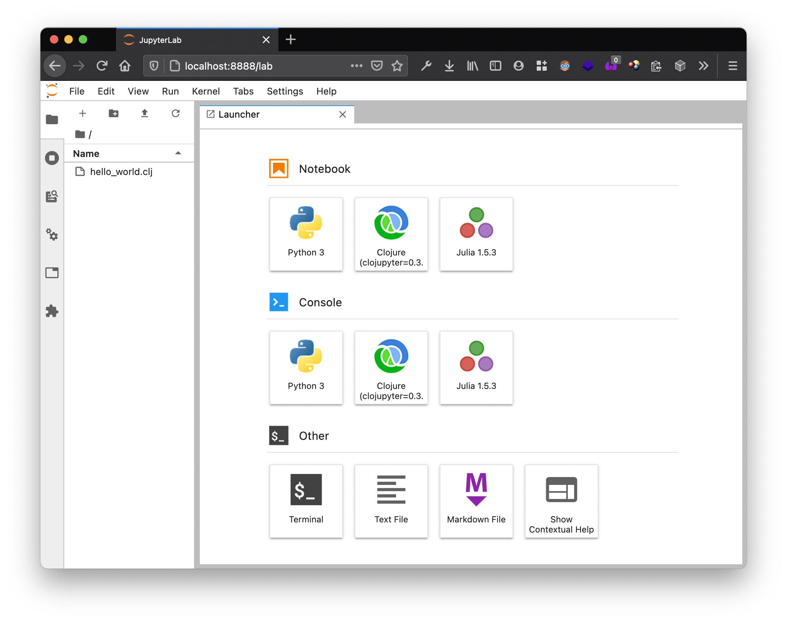
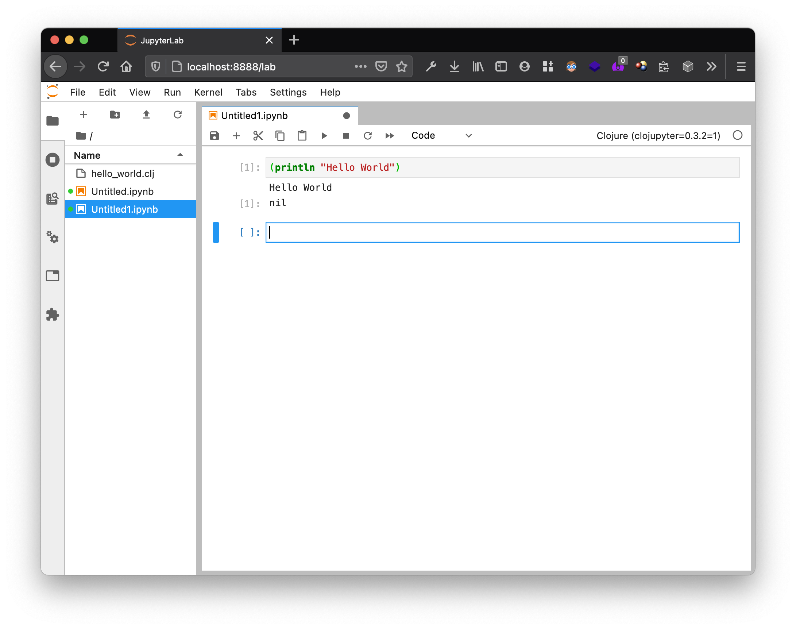

= Clojure
:experimental:
:source-highlighter: coderay

:toc:

== Cover

Blah blah blah blah blah blah blah blah blah blah. So it's a great cover with a mission pission and vision.

== Copyright

You should not copy this book, because I invented the English language, I invented cloujre, I type this book with my own generated knowledge which is independent of any other knowledge in this universe.

If you copy I will drag you to court, charge you million dollars and make your life miserable, because humanity's progress is based on copyright and not free flowing information.

Lol. This book is under GFDL, do what you want with it.

== Author

Blah blah blah blah blah blah blah blah blah blah. So I am  a great guy with a mission pission and vision.

Whaat? What else you expect from me?

== Prerequisite

== Why this book?

For unknown reason very smart programmers are using Clojure, I haven't figured out why. The writing of this book is to figure out why. My last job was in a medical coding company where we maintained 3 Rails app, I got to code in two of them, one had 0.1+ million lines of code, was headed by a guy who knew how to code and was maintained okay, other had 0.2+ million lines of code, had no test, headed by a guy who did not know how to code but could just do politics, that project prior to him was headed by people who did not know how to write maintainable software and senior developers in the project had to bear the brunt of history. It showed me how screwed Rails app can get if left unattended.

When I first met Ruby on Rails, I was very sure PHP will be the king of web page making, and it's true even today, but Rails changed my life and made me more productive. I will not say that with Rails we cannot handle massive projects, in my present job extremely skilled people and me are doing just that, but then this book is just a search, a very similar search I did in my PHP days when I got a hint of the power of Ruby, and this book is to document my search, if Clojure is good enough or not.

Another reason why I am going into Clojure is because of ClojureScript. If I can use the same language on both client and server side and if its not dreaded JavaScript, who wouldn't want to explore such language? Lisp seems to be a very old language and Clojure seems to be a Lisp dialect. Some how the inventors of Lisp seem to have struck the right balance early on, and I need to find out what it is.

I have lot of Data Science ideas, and looks like Clojure is fast and powerful enough to be used in those fields too. I want  to explore that too, though I wonder if JVM ever runs on GPU for fast computation.

One negative I find is JVM. Java is controlled by Oracle and its an evil enterprise like Microsoft and Apple. That's the only negative I have , but let's see how things go.

== Where to get help

== Installing Clojure

https://www.clojure.org/guides/getting_started

=== clj

----
$ clj
Clojure 1.10.2
user=> (println "Hello World")
Hello World
nil
user=>
----

kbd:[CTRL + D]

=== Clojure in file

.hello_world.clj
[source,clojure,linenums]
----
include::code/hello_world.clj[]
----

=== Clojure in jupyter

https://anaconda.org/simplect/clojupyter

----
$ jupyter lab
[I 11:52:44.061 LabApp] JupyterLab extension loaded from /Users/mindaslab/miniconda3/lib/python3.8/site-packages/jupyterlab
[I 11:52:44.061 LabApp] JupyterLab application directory is /Users/mindaslab/miniconda3/share/jupyter/lab
[I 11:52:44.065 LabApp] Serving notebooks from local directory: /Users/mindaslab/author/clojure/code
[I 11:52:44.065 LabApp] Jupyter Notebook 6.2.0 is running at:
[I 11:52:44.065 LabApp] http://localhost:8888/?token=ea48b1df457bf2b5961654e54872b2f43013d1e2eb02d3e0
[I 11:52:44.065 LabApp]  or http://127.0.0.1:8888/?token=ea48b1df457bf2b5961654e54872b2f43013d1e2eb02d3e0
[I 11:52:44.065 LabApp] Use Control-C to stop this server and shut down all kernels (twice to skip confirmation).
[C 11:52:44.072 LabApp]

    To access the notebook, open this file in a browser:
        file:///Users/mindaslab/Library/Jupyter/runtime/nbserver-55223-open.html
    Or copy and paste one of these URLs:
        http://localhost:8888/?token=ea48b1df457bf2b5961654e54872b2f43013d1e2eb02d3e0
     or http://127.0.0.1:8888/?token=ea48b1df457bf2b5961654e54872b2f43013d1e2eb02d3e0
----

kbd:[CTRL + C]

== First Steps

=== Hello World

=== Variables

=== Arithmetic

=== Strings

== Logic and branching

== Vectors and lists

== Functions

