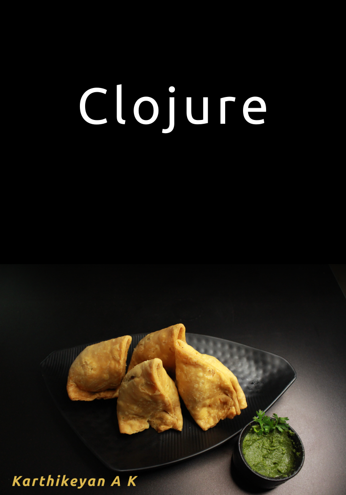

= Clojure
:toc: left
:experimental:
:source-highlighter: coderay

include::cover.adoc[]

include::copyright.adoc[]

include::author.adoc[]

include::prerequisite.adoc[]

include::why_this_book.adoc[]

include::where_to_get_help.adoc[]

include::getting_this_book.adoc[]

include::installing_clojure.adoc[]

include::first_steps.adoc[]

== Functions

== Data Structures

=== Vectors

=== Lists

=== Maps

=== Sets

=== Keywords

== Logic and comparison

=== Whats true and false

== Conditions and branching

=== if

=== do when

