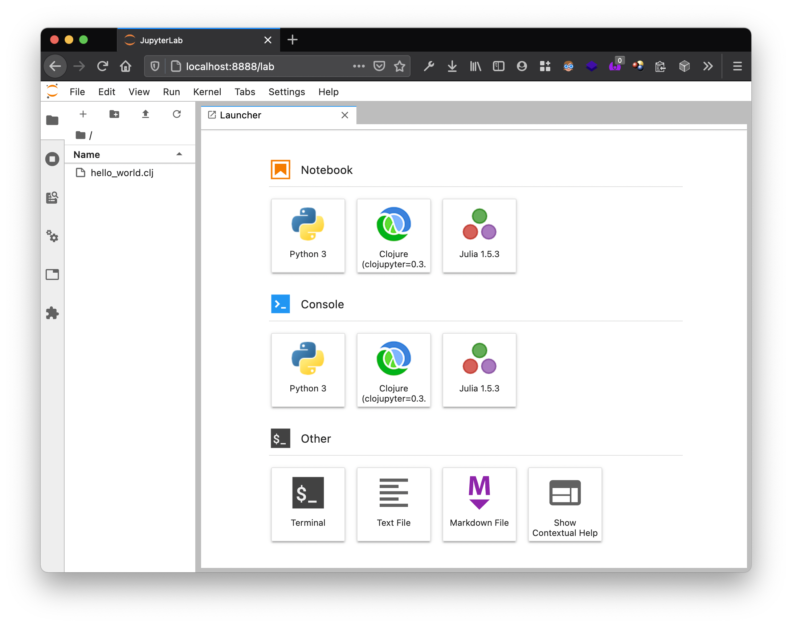
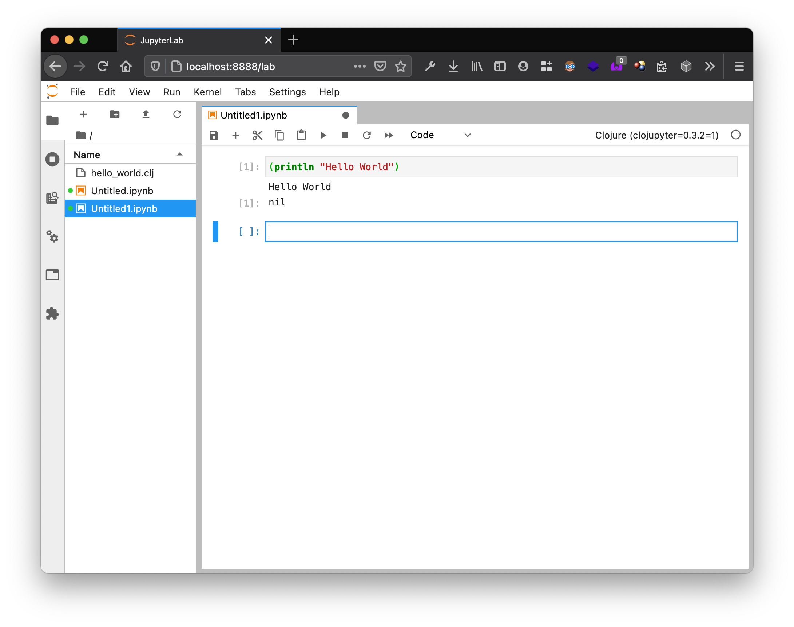

== Installing Clojure

https://www.clojure.org/guides/getting_started

=== clj

----
$ clj
Clojure 1.10.2
user=> (println "Hello World")
Hello World
nil
user=>
----

kbd:[CTRL + D]

=== Clojure in file

.hello_world.clj
[source,clojure,linenums]
----
include::code/hello_world.clj[]
----

=== Clojure in jupyter

https://anaconda.org/simplect/clojupyter

----
$ jupyter lab
[I 11:52:44.061 LabApp] JupyterLab extension loaded from /Users/mindaslab/miniconda3/lib/python3.8/site-packages/jupyterlab
[I 11:52:44.061 LabApp] JupyterLab application directory is /Users/mindaslab/miniconda3/share/jupyter/lab
[I 11:52:44.065 LabApp] Serving notebooks from local directory: /Users/mindaslab/author/clojure/code
[I 11:52:44.065 LabApp] Jupyter Notebook 6.2.0 is running at:
[I 11:52:44.065 LabApp] http://localhost:8888/?token=ea48b1df457bf2b5961654e54872b2f43013d1e2eb02d3e0
[I 11:52:44.065 LabApp]  or http://127.0.0.1:8888/?token=ea48b1df457bf2b5961654e54872b2f43013d1e2eb02d3e0
[I 11:52:44.065 LabApp] Use Control-C to stop this server and shut down all kernels (twice to skip confirmation).
[C 11:52:44.072 LabApp]

    To access the notebook, open this file in a browser:
        file:///Users/mindaslab/Library/Jupyter/runtime/nbserver-55223-open.html
    Or copy and paste one of these URLs:
        http://localhost:8888/?token=ea48b1df457bf2b5961654e54872b2f43013d1e2eb02d3e0
     or http://127.0.0.1:8888/?token=ea48b1df457bf2b5961654e54872b2f43013d1e2eb02d3e0
----

kbd:[CTRL + C]
