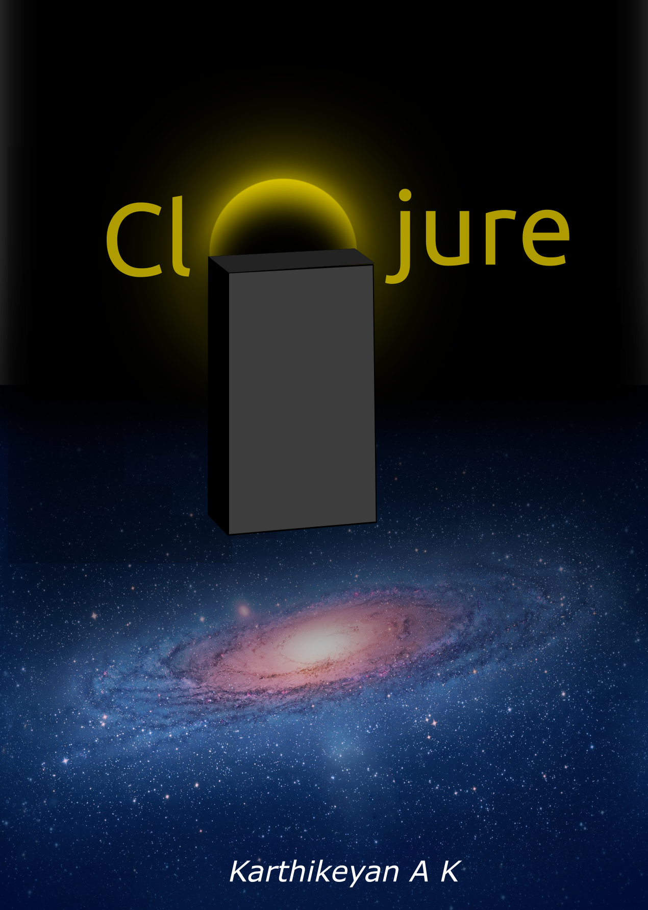

= Clojure
Karthikeyan.A.K <mindaslab@protonmail.com>
:doctype: book
:toc: left
:experimental:
:icons: font
:source-highlighter: rouge
:code-url: https://gitlab.com/clojure-book/code/-/raw/master
:diagram-url: https://gitlab.com/clojure-book/digrams/-/raw/master
:stem:
:cache-uri:
:front-cover-image: 
:back-cover-image: 

include::content.adoc[]
