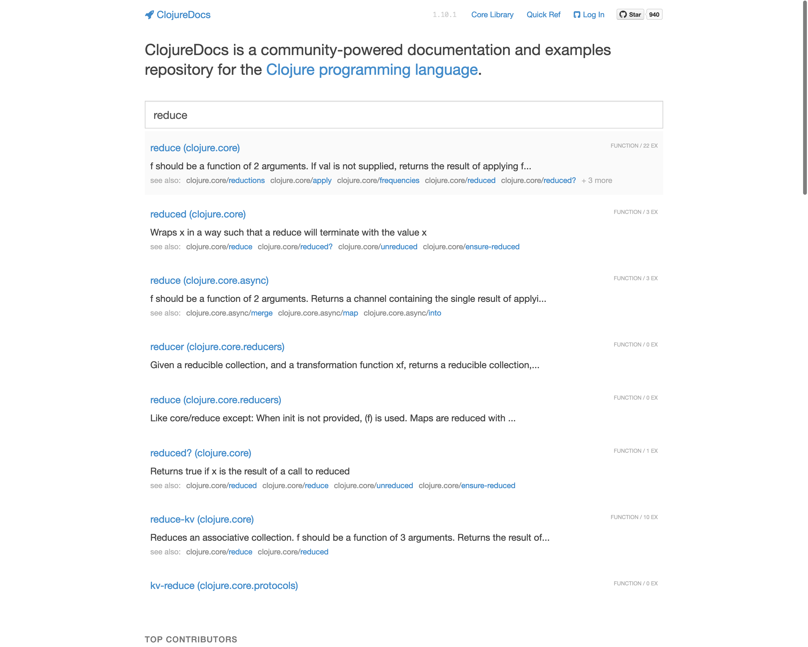

== Reading Clojure Documentation

The fact that you are reading this book is because, this book documents something about Clojure. In programming, documentation is very important, almost all programming languages have a way of documenting and a way of accessing it. Clojure is no different. In this section we will see how to access Clojure's documentation.

=== doc

Clojure has a function named `doc`, to it, you pass any valid function name, in the below we pass `+` to `doc` and its documentation gets printed:

[source, clojure]
----
(doc +)
----

Output

----
clojure.core/+
([] [x] [x y] [x y & more])
  Returns the sum of nums. (+) returns 0. Does not auto-promote
  longs, will throw on overflow. See also: +'
nil
----

From the above documentation I know `+` can receive no argument and might return a zero:

[source, clojure]
----
(+)
----

Output

----
0
----

Which seems to be true as shown above. I also infer `+` receives a single argument and returns the number:

[source, clojure]
----
(+ 42)
----

Output

----
42
----

Which also seems to be true. Then I infer `+` receives a two or more arguments and returns its sum, which also is verified in the code below:

[source, clojure]
----
(+ 40 2)
----

Output

----
42
----

[source, clojure]
----
(+ 10 30 2)
----

Output

----
42
----

=== find-doc

If you want to search the entire Clojure documentation text, you can use the `find-doc` method as shown below:

[source, clojure]
----
(find-doc "sum of nums")
----

Output

----
clojure.core/+
([] [x] [x y] [x y & more])
  Returns the sum of nums. (+) returns 0. Does not auto-promote
  longs, will throw on overflow. See also: +'
-------------------------
clojure.core/+'
([] [x] [x y] [x y & more])
  Returns the sum of nums. (+') returns 0. Supports arbitrary precision.
  See also: +
nil
clj꞉user꞉> 
-------------------------
clojure.core/+
([] [x] [x y] [x y & more])
  Returns the sum of nums. (+) returns 0. Does not auto-promote
  longs, will throw on overflow. See also: +'
-------------------------
clojure.core/+'
([] [x] [x y] [x y & more])
  Returns the sum of nums. (+') returns 0. Supports arbitrary precision.
  See also: +
----

Above I have found functions whose documentation contains the string sum of nums.

=== apropos

If you want to search for functions whose name contain certain piece of string, use the `apropos` function as shown below:
 
[source, clojure]
----
(apropos "replace")
----

Output

----
(clojure.core/replace clojure.string/re-quote-replacement clojure.string/replace clojure.string/replace-first clojure.walk/postwalk-replace clojure.walk/prewalk-replace clojure.zip/replace)
----

Above, I have use the `apropos` function to find all functions whose name contains the string `"replace"`. Now below I check the documentation of the function `replace` to reveal what it does: 

[source, clojure]
----
(doc replace)
----

Output

----
-------------------------
clojure.core/replace
([smap] [smap coll])
  Given a map of replacement pairs and a vector/collection, returns a
  vector/seq with any elements = a key in smap replaced with the
  corresponding val in smap.  Returns a transducer when no collection
  is provided.
nil
----

=== Clojure docs online

If one is not comfortable to use Clojure REPL to access documentation, one may use Clojure's online documentation which is available on https://clojuredocs.org/

image::images/clojuredocs.png[]

If you see the image below, I have searched for reduce, and it shows all functions who names have the word reduce in them.

I clicked on `reduce` and below you can see that Clojure shows documentation for it:
 
image::images/clojuredocs_3.png[]

Clojure docs is a convenient way access documentation on the browser.
