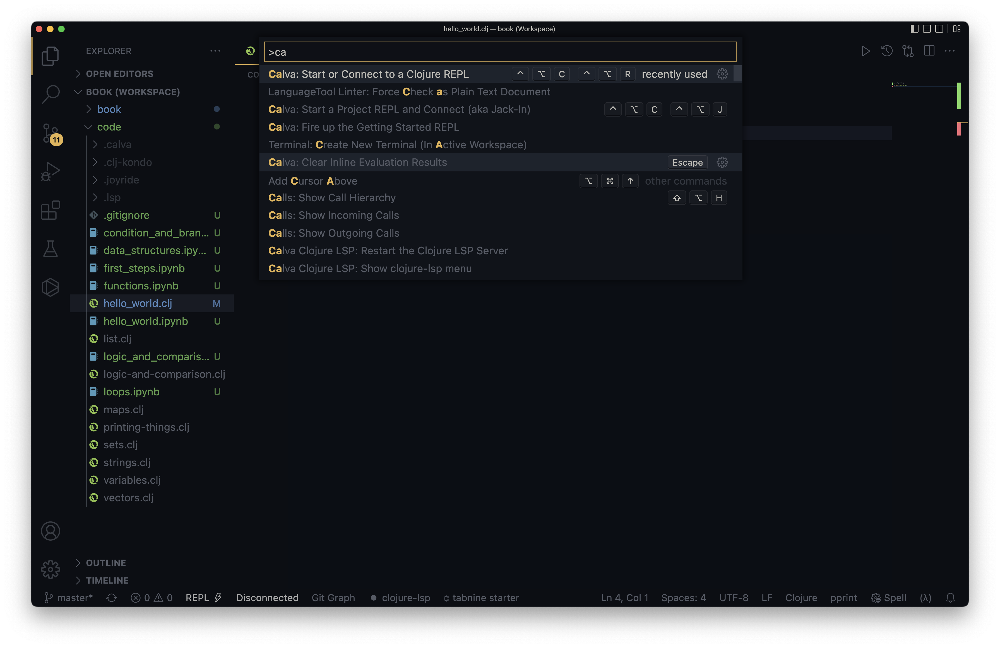
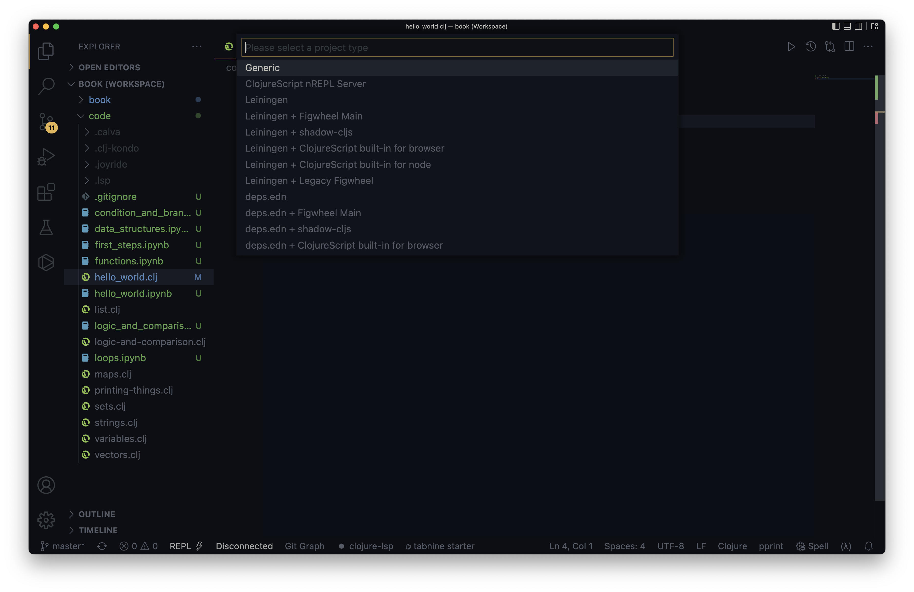

=== REPL

// what is REPL

==== REPL in Terminal

----
$ clj
Clojure 1.11.1
user=> (println "Hello World")
Hello World
nil
user=>
----

kbd:[CTRL+ D]

==== REPL in VSCode

----
$ lein repl
nREPL server started on port 52897 on host 127.0.0.1 - nrepl://127.0.0.1:52897
REPL-y 0.4.4, nREPL 0.8.3
Clojure 1.10.1
OpenJDK 64-Bit Server VM 1.8.0_152-release-1056-b12
    Docs: (doc function-name-here)
          (find-doc "part-of-name-here")
  Source: (source function-name-here)
 Javadoc: (javadoc java-object-or-class-here)
    Exit: Control+D or (exit) or (quit)
 Results: Stored in vars *1, *2, *3, an exception in *e

user=>
----

image::images/connect-to-repl-2.png[]

image::images/connect-to-repl-4.png[]

image::images/connect-to-repl-5.png[]
