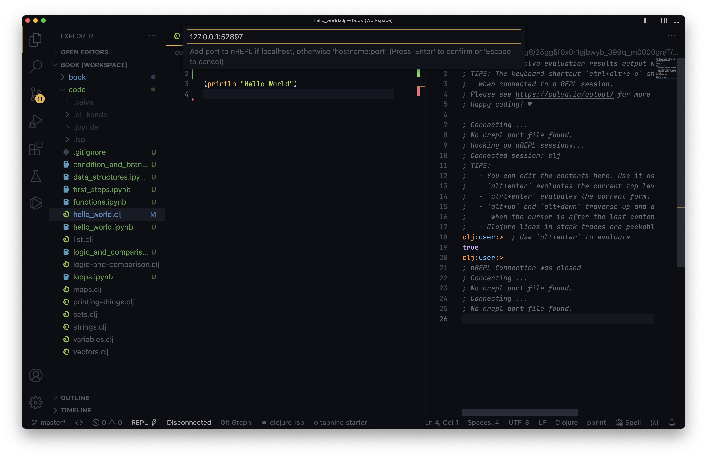
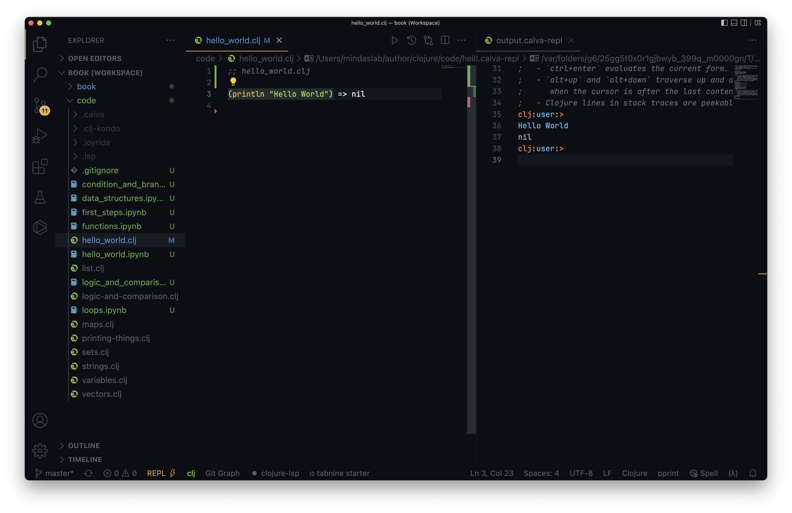

=== REPL

When I first started to study Clojure, I was introduced to REPL driven development. I did not get it what it was during my early day, even if you don't get it, worry not, you will eventually get it. In this let's get a taste of REPL driven development.

==== REPL in Terminal

In your terminal type `clj` and you will be presented with something as shown

----
$ clj
Clojure 1.11.1
user=>
----

The `Clojure 1.11.1` tells us that Clojure version 1.11.1 is installed on my machine, and then it shows something like `user=>`. That is Clojure is prompting you to enter something. Type in `(println "Hello World")` as shown and press enter:

----
$ clj
Clojure 1.11.1
user=> (println "Hello World")
Hello World
nil
user=>
----

You get the output `Hello World` printed out, and a strange thing `nil` in a line after that and once again you have been prompted to enter something at `user=>`

You can now press kbd:[CTRL+ D] to exit the REPL.

So what really happened when you typed `clj`. The first thing was Clojure prompted you with `user=>`. You typed in something into the prompt, and pressed entered, Clojure REPL **R**ead it and **E**valuated it, understood that you want to print `Hello World`, next Clojure printed out the `Hello World`, then it also **P**rint a thing called `nil`, then it **L**ooped back again and prompted you with `user=>`.

==== REPL in VSCodium

We have seen REPL in action in terminal, let's now see it in action in VSCodium. Create a folder named `code` and open that location with VSCodium, now crate a file named `hello_world.clj` in it with the following content:

{code-url}/hello_world.clj[hello_world.clj]
[source, clojure]
----
;; hello_world.clj

(println "Hello World")
----

Now in terminal `cd` into `code/` and type `lein repl`

----
$ lein repl
nREPL server started on port 52897 on host 127.0.0.1 - nrepl://127.0.0.1:52897
REPL-y 0.4.4, nREPL 0.8.3
Clojure 1.10.1
OpenJDK 64-Bit Server VM 1.8.0_152-release-1056-b12
    Docs: (doc function-name-here)
          (find-doc "part-of-name-here")
  Source: (source function-name-here)
 Javadoc: (javadoc java-object-or-class-here)
    Exit: Control+D or (exit) or (quit)
 Results: Stored in vars *1, *2, *3, an exception in *e

user=>
----

The lein is short for Leningen, if you might remember installing it and checking if it launched. `repl` tells `lein` to start a REPL. You will see a output as shown. Note `nrepl://127.0.0.1:52897` in the above output, it means that there is a REPL server running at IP 127.0.0.1 footnote:[https://en.wikipedia.org/wiki/Localhost] and at port number footnote:[https://en.wikipedia.org/wiki/Port_(computer_networking)] 52897. Note down `127.0.0.1:52897`. May be the port number could vary in your case.

image::images/connect-to-repl-1.png[]

In VSCodium type kbd:[CTRL+P] or kbd:[command+P] and type `>`, now you can  type in some commands for VSCodium to execute. In it try typing `Calva: Start or connect to a Clojure REPL`, before you finish typing it, VSCodium would have selected that option for you, press kbd:[ENTER] or click on it.

image::images/connect-to-repl-2.png[]

VSCodium wil present another set of menus, in it select `Connect to a running REPL, not in your project`.

image::images/connect-to-repl-3.png[]

Now in the presented option select `Generic` as shown above. Now it would prompt for the IP and port number where your REPL is running.

Paste the copied value `127.0.0.1:52897` and press enter. At the right you will see a Clojure REPl window being opened. Now in the file at left in `hello_world.clj`, keep your cursor inside `(println "Hello World")` and press kbd:[ALT+ENTER] or kbd:[option+return]

You will see the `(println "Hello World")` evaluated and printed in right-hand REPL pane. Congratulations, you learned how to connect REPL with VSCodium.
