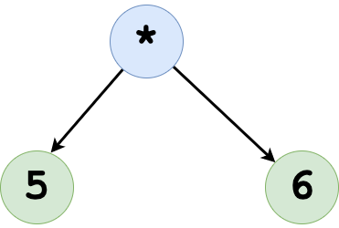

== What is Clojure code

Clojure is a dialect of Lisp. Lisp stands for list processing. That is almost all Clojure code is a list data structure. In lisp, program is a data structure, and data structure could be treated as a program, which gives it enormous power.

Clojure's code follows one pattern and that is this:

[source clojure]
----
(function-name argument-1 .... argument-n)
----

See above how everything is enclosed in `(` and `)` which is a list data structure, and as a list processing language Clojure has the knowledge to process it.

Let's consider the following example:

[source, clojure]
----
(* 5 (+ 1 2 3))
----

The above list could be represented as following, the `*` function receives two arguments, the first one is `5` and the second one is (+ 1 2 3). This can be diagrammatically represented as follows:

image::images/what-is-clojure-code-1.png[]

Now look at the deepest blue dots, that is `1`, `2` and `3`, they feed into the `+` function and gets reduced to 6, so we get a new data structure as shown:

This can be written as shown:

(* 5 6) in lisp. That is `5` and `6` get's fed into `*` function which multiplies it and we get `30` as output.

image::images/what-is-clojure-code-3.png[]

Because Clojure is lisp, it has excellent uniformity in code, unlike Object-Oriented languages one may need not remember complex syntax, it's light on your brain freeing your other neurons to tackle the business problems.
