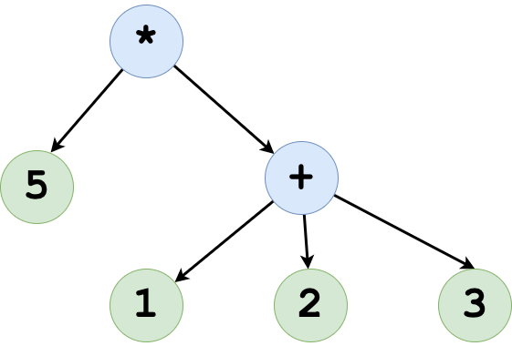

== What is Clojure code

// list
// LISP
// A tree structure explain how its evaluated.

[source, clojure]
----
(* 5 (+ 1 2 3))
----

image::images/what-is-clojure-code-2.png[]

image::images/what-is-clojure-code-3.png[]

